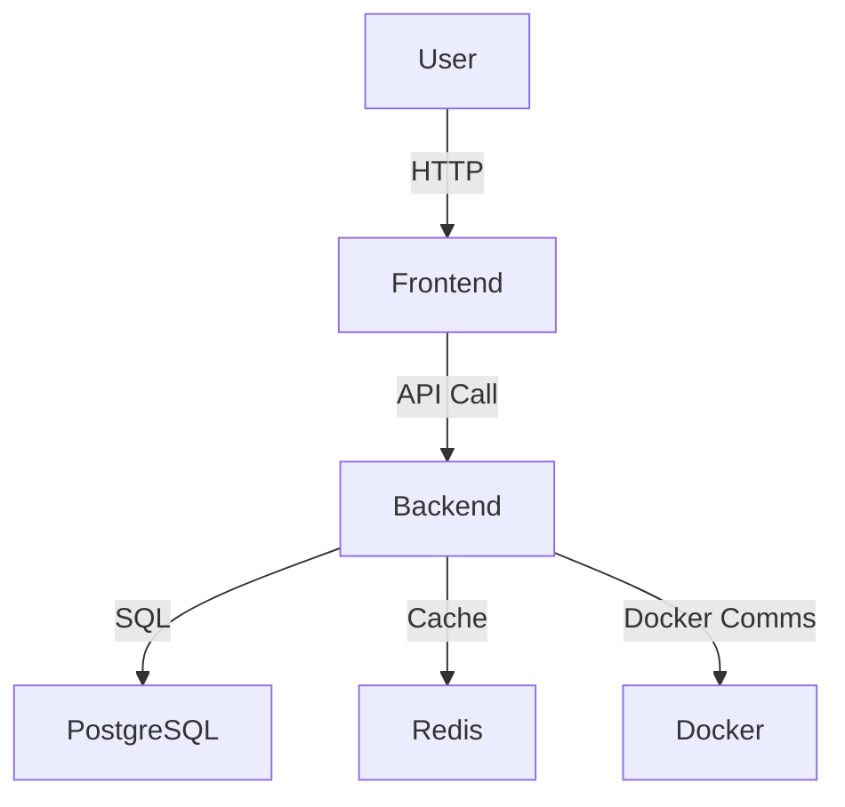

# Architecture Overview

## System Design

ShuttleMatch is designed as a microservices architecture with separate components for the frontend, backend, and supporting infrastructure. The primary communication between services is through RESTful API calls.

### Component Descriptions

- **Frontend**: Built with Next.js and TypeScript, it provides a responsive user interface for all user roles.
- **Backend**: Developed using FastAPI in Python, it handles all business logic, user authentication, and API requests.
- **Database**: Utilizes PostgreSQL for relational data and Redis for caching.
- **Infrastructure**: Docker and Docker Compose are used for containerization and orchestration, while Nginx acts as a reverse proxy.

### Data Flow

The data flow begins with user interactions on the frontend, which sends requests to the backend API. The backend processes these requests, interacts with the database and cache, and returns responses to the frontend.