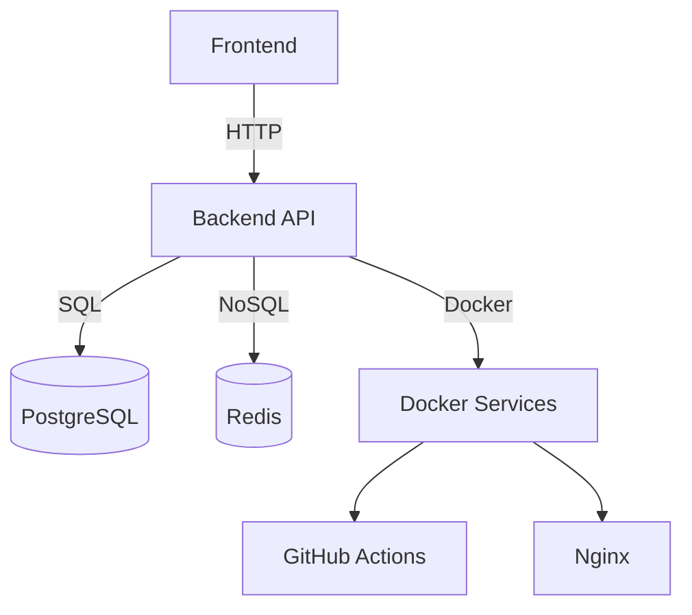

# ShuttleMatch


## Streamline Badminton Tournaments for Organizers, Players, and Umpires

ShuttleMatch is a comprehensive sports management platform that simplifies the organization and management of badminton tournaments. It caters to the needs of tournament organizers, players, and umpires by providing a seamless experience from registration to score tracking.

## Features

- ✓ Tournament Creation
- ✓ Player Registration
- ✓ Match Scheduling
- ✓ Score Tracking
- ✓ User Authentication
- ✓ Role-Based Access Control
- ✓ Notifications
- ✓ Tournament Dashboard

## Quick Start

```bash
# Clone the repository
git clone https://github.com/yourusername/shuttlematch.git

# Navigate to the project directory
cd shuttlematch

# Start the application
docker-compose up --build
```

## Prerequisites

| Tool            | Version   |
|-----------------|-----------|
| Docker          | 20.10+    |
| Docker Compose  | 1.29+     |
| Node.js         | 16.0+     |
| Python          | 3.9+      |

## Complete Docker Compose Setup

```yaml
version: '3.8'

services:
  backend:
    build: ./backend
    container_name: shuttlematch_backend
    ports:
      - "8000:8000"
    env_file:
      - .env
    depends_on:
      - db
      - redis

  frontend:
    build: ./frontend
    container_name: shuttlematch_frontend
    ports:
      - "3000:3000"
    depends_on:
      - backend

  db:
    image: postgres:15
    container_name: shuttlematch_db
    environment:
      POSTGRES_USER: user
      POSTGRES_PASSWORD: password
      POSTGRES_DB: shuttlematch
    volumes:
      - postgres_data:/var/lib/postgresql/data

  redis:
    image: redis:7
    container_name: shuttlematch_redis

volumes:
  postgres_data:

networks:
  default:
    driver: bridge
```

## API Usage Examples

```bash
# Register a new user
curl -X POST http://localhost:8000/api/v1/auth/register -H "Content-Type: application/json" -d '{"email":"user@example.com", "password":"password", "role":"player"}'

# Login user
curl -X POST http://localhost:8000/api/v1/auth/login -H "Content-Type: application/json" -d '{"email":"user@example.com", "password":"password"}'

# Create a new tournament
curl -X POST http://localhost:8000/api/v1/tournaments -H "Authorization: Bearer <token>" -H "Content-Type: application/json" -d '{"name":"Spring Open", "location":"City Sports Hall", "date":"2023-05-25"}'
```

## Environment Variables

| Name               | Required | Default          | Description                            |
|--------------------|----------|------------------|----------------------------------------|
| DATABASE_URL       | Yes      |                  | Connection string for PostgreSQL       |
| REDIS_URL          | Yes      |                  | Connection string for Redis            |
| SECRET_KEY         | Yes      |                  | Secret key for JWT tokens              |
| ACCESS_TOKEN_EXPIRE| No       | 30 minutes       | Expiration time for access tokens      |

## Architecture Diagram



## Tech Stack

| Component   | Technology                     |
|-------------|--------------------------------|
| Backend     | Python, FastAPI, SQLAlchemy    |
| Frontend    | Next.js, TypeScript, TailwindCSS |
| Database    | PostgreSQL, Redis              |
| DevOps      | Docker, GitHub Actions, Nginx  |

## License

This project is licensed under the MIT License.

## Documentation

For detailed documentation, please visit the [docs folder](docs/).