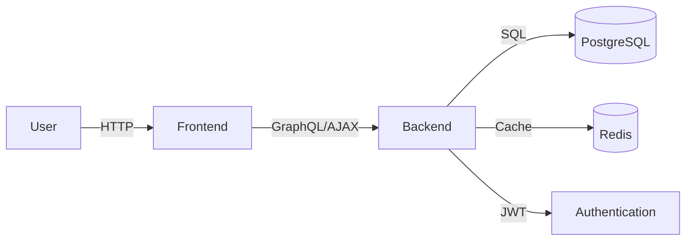

# ShuttleMatch


Welcome to ShuttleMatch, the ultimate solution for streamlining badminton tournaments for organizers, players, and umpires.

## Features

- ✓ Tournament Creation
- ✓ Player Registration
- ✓ Match Scheduling
- ✓ Score Tracking
- ✓ User Authentication
- ✓ Role-Based Access Control
- ✓ Notifications
- ✓ Tournament Dashboard

## Quick Start

To get ShuttleMatch up and running, execute the following commands:

```bash
# Clone the repository
git clone https://github.com/yourusername/shuttle-match.git

# Navigate to the project directory
cd shuttle-match

# Start the application using Docker Compose
docker-compose up
```

## Prerequisites

| Tool           | Version   |
|----------------|-----------|
| Docker         | 20.10+    |
| Docker Compose | 1.29.2+   |
| Node.js        | 16.13+    |
| npm            | 8.1+      |
| Python         | 3.9+      |

## Docker Compose Setup

```yaml
version: '3.9'
services:
  web:
    build: ./frontend
    ports:
      - "3000:3000"
    environment:
      - NODE_ENV=production

  api:
    build: ./backend
    ports:
      - "8000:8000"
    environment:
      - DATABASE_URL=postgresql://user:password@db/shuttle_match

  db:
    image: postgres:15
    environment:
      POSTGRES_USER: user
      POSTGRES_PASSWORD: password
      POSTGRES_DB: shuttle_match

  redis:
    image: redis:7
```

## API Usage Examples

Here are some example API calls using `curl`:

### Register a User

```bash
curl -X POST http://localhost:8000/api/v1/auth/register \
-H "Content-Type: application/json" \
-d '{"email": "user@example.com", "password": "yourpassword", "role": "Player"}'
```

### Login a User

```bash
curl -X POST http://localhost:8000/api/v1/auth/login \
-H "Content-Type: application/json" \
-d '{"email": "user@example.com", "password": "yourpassword"}'
```

## Environment Variables

| Name             | Required | Default                    | Description                             |
|------------------|----------|----------------------------|-----------------------------------------|
| DATABASE_URL     | Yes      |                            | Connection string for the PostgreSQL DB |
| REDIS_URL        | No       | redis://localhost:6379/0   | Redis connection URL                    |
| SECRET_KEY       | Yes      |                            | Secret key for JWT encoding             |

## Architecture Diagram



## Tech Stack

| Component       | Technology                    |
|-----------------|-------------------------------|
| Backend         | FastAPI, Python               |
| Frontend        | Next.js, TypeScript           |
| Database        | PostgreSQL, Redis             |
| Infrastructure  | Docker, Docker Compose, Nginx |

## Links

For more detailed documentation, please refer to the [docs](./docs) folder.