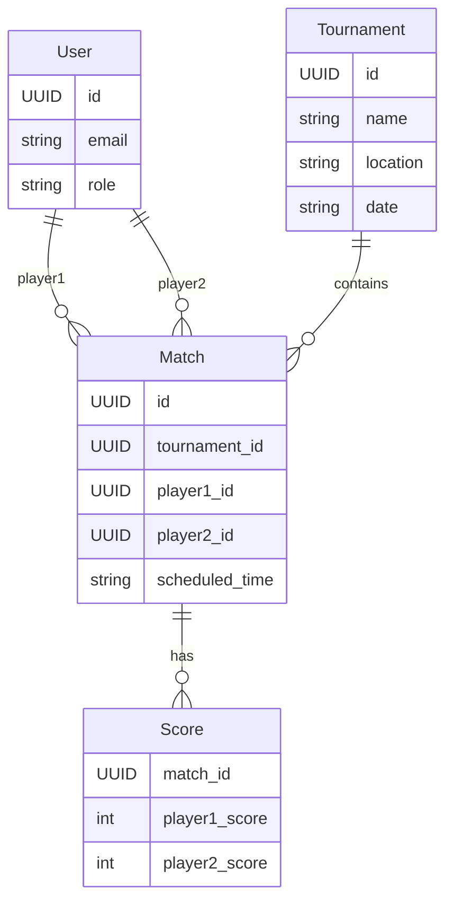

# Database Documentation

## Schema Overview

The ShuttleMatch database schema is designed to support tournament management with entities for users, tournaments, matches, and scores.

### Entity Relationships

- **User**: Represents a participant in the system, either as an organizer, player, or umpire.
- **Tournament**: Contains information about tournaments, including location and date.
- **Match**: Represents individual matches within a tournament.
- **Score**: Tracks the scores associated with matches.

### Diagram



## Migration Guide

- Use `Alembic` for managing database migrations.
- To create a new migration:
  ```bash
  alembic revision --autogenerate -m "Description of changes"
  ```
- To apply migrations:
  ```bash
  alembic upgrade head
  ```